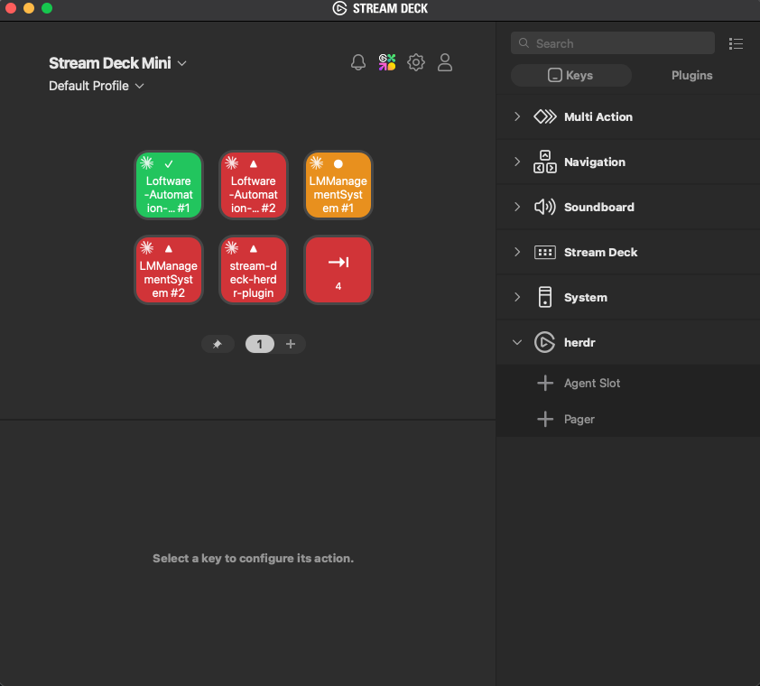

# herdr agents — Stream Deck plugin

Live [herdr](https://herdr.dev) agent status on your Elgato Stream Deck.

See which of your AI coding agents are running, busy, blocked, or finished — at a
glance, on physical keys. Press a key to jump straight to that agent's pane and
bring your terminal to the foreground. No more hunting through tabs to find the
agent that's waiting on you.



## What it does

- **One key per agent.** Each key mirrors a live herdr agent: its **space name** +
  status color + a monochrome logo of the agent type (Claude, Codex, …). Rename a
  space in herdr and the key follows — handy for giving keys short, readable
  names. Labels wrap to three lines and ellipsize past ~24 characters.
- **Status at a glance** — color and glyph encode `working` / `blocked` / `done`
  / `idle` (see the table below).
- **Press = focus.** A short press runs `herdr agent focus` for that pane *and*
  raises the host terminal app, so the agent is actually on screen even if the
  terminal was in the background.
- **Mirrors herdr.** The deck shows every agent in the same order herdr's agent
  panel does — including its `priority` (attention queue) ordering if that is how
  you have herdr set up — so key 1 is herdr's first row. Nothing to configure:
  keys fill left-to-right, top-to-bottom, and how many agents fit on a page is
  simply how many keys you placed.
- **Morphing pager key.** When an agent needs attention *that this page cannot
  show*, it becomes a "jump to the next blocked/done agent" key (cycles on repeat
  presses) and shows a badge; otherwise it pages through the grid. One key, both
  jobs — fits the 6-key Mini.
- **Active notifications.** When an agent flips to `blocked` or `done` you get a
  herdr notification with a sound (`request` / `done`) and the key flashes — even
  when you're not looking at the deck.
- **Instant updates.** Refreshes on herdr socket events (push), with a slow
  safety-net poll as a backstop — no busy 1-second polling.

## Status → key

| status   | color      | glyph | meaning           |
|----------|------------|-------|-------------------|
| working  | orange     | ●     | running now        |
| blocked  | red        | ▲     | wants you          |
| done      | green      | ✓     | finished, unseen   |
| idle     | grey       | ○     | waiting            |
| unknown  | near-black | ·     | —                  |
| empty    | black      |       | no agent in slot   |

## Tested on

- **Stream Deck Mini** (6 keys)
- macOS 26 (Apple Silicon)
- Elgato Stream Deck app **7.4.2**
- **herdr 0.7.0**

The plugin is keypad-only and works on any Stream Deck model with keys. The
default layout assumes the 6-key Mini, but you can place the two actions on a
deck of any size.

## Requirements

- macOS 12 or newer
- [Elgato Stream Deck](https://www.elgato.com/stream-deck) app 7.1+
- [herdr](https://herdr.dev) 0.7.0+ installed and running (`herdr` on your `PATH`)
- To build from source: [Bun](https://bun.sh) and Node.js 24

## Install

### From source

```bash
git clone https://github.com/timvdhoorn/stream-deck-herdr-plugin.git
cd stream-deck-herdr-plugin
bun install
bun run build

# enable Stream Deck developer mode (one-time), then link + start the plugin
bunx streamdeck dev
bunx streamdeck link dev.timvdhoorn.herdr-agents.sdPlugin
bunx streamdeck restart dev.timvdhoorn.herdr-agents
```

### As a packaged plugin

Produce a double-clickable `.streamDeckPlugin` installer:

```bash
bun run build
bunx streamdeck pack dev.timvdhoorn.herdr-agents.sdPlugin
```

This writes `dev.timvdhoorn.herdr-agents.streamDeckPlugin` — double-click it to
install into the Stream Deck app.

## Layout & usage

In the Stream Deck app, drag the two actions from the **herdr** category onto
your keys. There is nothing to configure — a key's position decides which agent it
shows. The recommended 6-key Mini layout:

```
[ Agent Slot ][ Agent Slot ][ Agent Slot ]
[ Agent Slot ][ Agent Slot ][   Pager    ]
```

- **Agent Slot** — shows one agent. Keys fill in reading order (left-to-right,
  top-to-bottom) against herdr's agent panel, so the five keys above are its
  rows 1–5. Press one to focus that agent's pane and raise the terminal on herdr's tab.
  Its only setting is **Display**, choosing the space name (the default) or the
  terminal title as the label.
- **Pager** — pages through the grid, and shows `page X/Y`. When an agent needs
  attention on a page you cannot see, it badges the count and pressing jumps
  straight to that agent instead (repeat presses cycle).

Add or remove Agent Slot keys freely: page size follows. Place enough keys for all
your agents and the pager simply reports `1/1`. Using two Stream Decks? Each
mirrors the same agents rather than extending the grid.

## Configuration

None required. The plugin works out which terminal herdr is displayed in — and
which tab of it — by inspecting the attached `herdr` client process, so it follows
you when you relaunch or reattach herdr somewhere else. Resolution order:

1. `HERDR_DECK_TERMINAL_APP`, if set → `open -a <app>`.
2. The client's `WARP_FOCUS_URL` → `open <url>`, which raises Warp **and** selects
   herdr's exact tab in one step. No permissions, no keystrokes.
3. The client's `__CFBundleIdentifier` → `open -b <bundle id>`, raising whichever
   terminal herdr was launched from.
4. Otherwise → `open -a Warp`.

Both env vars are escape hatches for when that goes wrong:

| Env var | Default | Purpose |
|---------|---------|---------|
| `HERDR_DECK_TERMINAL_APP` | *(discovered)* | Pin the app to raise, by name — e.g. `Warp`, `Terminal`, `iTerm` (iTerm2), `Ghostty`, `WezTerm`. Note this **skips discovery**, so you lose exact-tab focusing: a bare app name cannot identify a tab. |
| `HERDR_DECK_TERMINAL_TAB` | *(off)* | Select a tab by sending Cmd-*N* after raising the app, for terminals that expose no focus URL. Valid values are `1`–`8`; `0` or `off` leaves the active tab alone. Ignored when step 2 applies. |

`HERDR_DECK_TERMINAL_TAB` is the only path that needs permissions: synthesizing a
keypress requires **Elgato Stream Deck** under System Settings › Privacy &
Security › Accessibility, plus the one-time Automation prompts. Without them the
app is still raised and only the tab switch fails, logged rather than silently
skipped. It is also positional — with several windows open, Cmd-*N* hits the most
recently used one.

Caveats worth knowing: `WARP_FOCUS_URL` is a real variable Warp exports but is not
part of its documented URI scheme, so it could change. Warp does have a proper
local control API (`app.activate`, `tab.activate`, `pane.focus`) inside the binary,
but it is disabled and undocumented — when it ships publicly it should replace
this. And because `ps` reports the environment a process was *exec'd* with,
discovery works via the `herdr` client you launched, not via Warp's own tab shells,
which export their `WARP_*` variables after exec.

## How it works

A single store polls/streams `herdr agent list`, normalizes the agents, and
notifies both actions to re-render. All herdr I/O is isolated in
`src/herdr/*` (injected `run` for tests), the pure logic lives in `src/core/*`
(unit-tested with `bun test`), and the Stream Deck actions in `src/actions/*` are
thin glue. Key images are rendered as SVG data URIs for crisp text on the 80×80
keys.

macOS integration sits in `src/os/*`, also behind an injected `run`. Focusing a
herdr pane only switches the pane *inside* herdr, so a key press additionally has
to put the host terminal on screen: `hostterminal.ts` works out which terminal —
and which tab of it — herdr is currently displayed in by reading the environment of
the attached `herdr` client process, and `terminal.ts` raises it via `open`. That
indirection is deliberate and the alternatives are non-obvious; the reasoning is in
[ADR 0001](docs/adr/0001-discover-host-terminal-from-herdr-client.md).

The agent list is herdr's: `herdr agent list` returns agents in the order herdr's
panel shows them under its default `spaces` sort, and the plugin does not filter
it. If you set `[ui] agent_panel_sort = "priority"` in `~/.config/herdr/config.toml`,
the plugin reads that and reproduces the attention queue, since the CLI always
reports `spaces` order. Slot order comes from each key's coordinates on the deck. Why that is derived rather than
configured — and what breaks in the alternatives — is in
[ADR 0002](docs/adr/0002-deck-mirrors-herdr-order.md).

## Development

```bash
bun test                    # run the unit tests
bunx tsc --noEmit           # type-check
bun run build               # bundle to …/bin/plugin.js
bun run watch               # rebuild + restart the plugin on change
```

## License

[MIT](LICENSE) © Tim van der Hoorn
